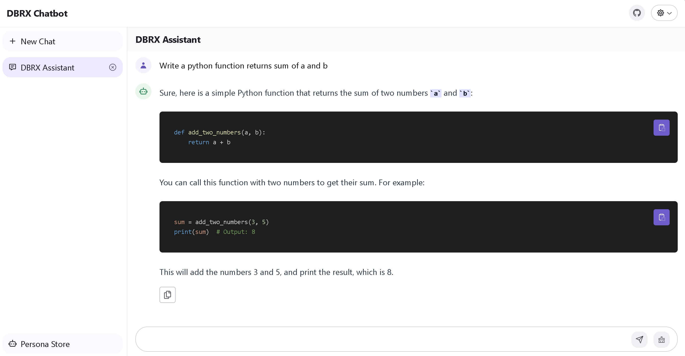

# DBRX Chatbot

DBRX Chatbot is an open-source AI chatbot application developed using the DBRX instruction API.

## Demo

Visit the [DBRX Chatbot Demo Site](https://dbrx.vercel.app)



## Prerequisites

You need an active Databricks workspace and and access token.

## Deployment

Refer to the [Environment Variables](#environment-variables) section for necessary environment variables.

### Deploy on Vercel

Click the button below to deploy on Vercel:

[](https://vercel.com/new/clone?repository-url=https%3A%2F%2Fgithub.com%2Fblrchen%2Fdbrx-chatbot&project-name=dbrx-chatbot&framework=nextjs&repository-name=dbrx-chatbot)

### Deploy with Docker

```
docker run -d -p 3000:3000 \
   -e DATABRICKS_WORKSPACE_URL="<REPLACE-ME>" \
   -e DATABRICKS_TOKEN="<REPLACE-ME>" \
   blrchen/dbrx-chatbot
```

## Development

### Running Locally

1. Install NodeJS 20.
2. Clone the repository.
3. Install dependencies with `npm install`.
4. Copy `.env.example` to `.env.local` and update environment variables.
5. Start the application using `npm run dev`.
6. Visit `http://localhost:3000` in your browser.

## Environment Variables

Required environment variables:

| Name                     | Description                                                                                        |
| ------------------------ | -------------------------------------------------------------------------------------------------- |
| DATABRICKS_WORKSPACE_URL | Your Databricks workspace URL. For example, `https://adb-3046417392244956.16.azuredatabricks.net`. |
| DATABRICKS_TOKEN         | Your Databricks access token.                                                                      |

## Contribution

PRs of all sizes are welcome.
